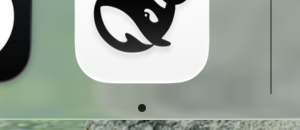
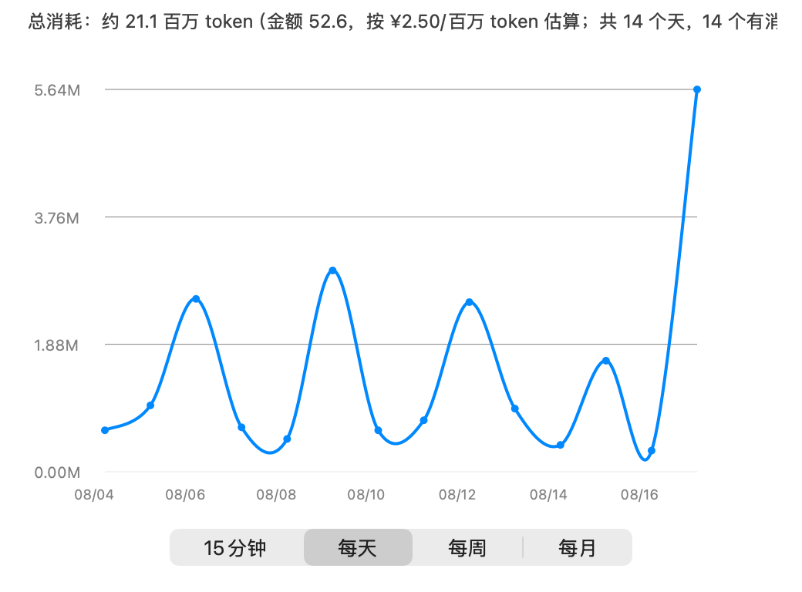

# DSH Balance — DeepSeek 余额监控 & 消耗图表（macOS 菜单栏）

> **English**: [README.en.md](README.en.md)

[](LICENSE)
[-brightgreen.svg)]()
[]()
[](https://github.com/yxq97/dsh-balance)

一个轻量的 macOS 菜单栏应用：常驻屏幕顶部显示 DeepSeek（或其他兼容提供方）的实时余额，支持消耗折线图、API Key 管理、充值跳转、刷新间隔自定义。

纯原生 Swift / AppKit 实现，**零第三方依赖**，源码可编译、可审计。

## 预览

**菜单栏实时余额**（常驻屏幕顶部，点击弹出菜单）：



**消耗图表窗口**（纵坐标 = 百万 token，可切换 15分钟 / 每天 / 每周 / 每月）：

| 每天（近 14 天） | 15 分钟（近 1 小时） |
| --- | --- |
|  |  |

## 功能

- **菜单栏实时余额**：默认每 60 秒刷新（可在菜单中改 5/10/30/60 秒），余额变化即时更新
- **消耗折线图**：点击图标 → "消耗图表…"，四档切换
  - **15分钟**：最近 1 小时，每 15 分钟一个节点
  - **每天**：最近 14 天
  - **每周**：最近 8 周
  - **每月**：最近 6 个月
- **纵坐标 = token 消耗量**（单位 M = 百万 token）：金额 → token 按"单价（元/百万 token）"换算，默认 ¥2.5（deepseek-v4-flash 混合价），可在配置中调整
- **多提供方支持**：内置 DSH 同款提供方列表（anthropic、google、groq、mistral…），选择即自动预填官方 Base URL；支持自定义第三方中转（DeepSeek 风格 / OpenAI 风格 / 自定义余额接口路径）
- **API Key 管理**：应用内配置 Key（仅存本机、文件权限 600），官方 DeepSeek 模式可回退使用 DSH 凭据文件 `~/.dsh/.credentials.yaml`
- **一键充值**：菜单直达 DeepSeek 开放平台充值页
- **开机自启**：LaunchAgent 常驻，崩溃自动重启

## 安装

### 方式一：从源码编译（推荐，可审计）

```bash
git clone https://github.com/yxq97/dsh-balance.git
cd dsh-balance
swiftc -parse-as-library -swift-version 5 -framework Cocoa -o DSHBalance DSHBalance.swift
# 打包成 .app
mkdir -p "DSH Balance.app/Contents/MacOS"
cp DSHBalance "DSH Balance.app/Contents/MacOS/DSHBalance"
cp Info.plist "DSH Balance.app/Contents/Info.plist"
codesign -s - --force "DSH Balance.app"
cp -R "DSH Balance.app" /Applications/
```

### 方式二：直接运行二进制

```bash
swiftc -parse-as-library -swift-version 5 -framework Cocoa -o DSHBalance DSHBalance.swift
./DSHBalance
```

### 开机自启（可选）

```bash
mkdir -p ~/Library/LaunchAgents
cat > ~/Library/LaunchAgents/com.local.DSHBalance.plist <<'EOF'
<?xml version="1.0" encoding="UTF-8"?>
<!DOCTYPE plist PUBLIC "-//Apple//DTD PLIST 1.0//EN" "http://www.apple.com/DTDs/PropertyList-1.0.dtd">
<plist version="1.0">
<dict>
    <key>Label</key><string>com.local.DSHBalance</string>
    <key>ProgramArguments</key>
    <array><string>/Applications/DSH Balance.app/Contents/MacOS/DSHBalance</string></array>
    <key>RunAtLoad</key><true/>
    <key>KeepAlive</key><true/>
</dict>
</plist>
EOF
launchctl bootstrap gui/$(id -u) ~/Library/LaunchAgents/com.local.DSHBalance.plist
```

## 使用

1. 首次启动：点击菜单栏余额图标 → **配置 API Key…**
2. 选择提供方（官方 DeepSeek 或第三方中转），填写 Key；选择提供方会自动预填官方 Base URL
3. 余额接口风格按提供方选择：DeepSeek 风格 `/user/balance`、OpenAI 风格 `/v1/dashboard/billing/credit_grants`、或自定义路径
4. 如需 token 图表换算精确：在配置中调整"单价（元/百万 token）"

## 数据与隐私

- API Key 只保存在本机：`~/Library/Application Support/DSH Balance/config.json`（权限 600）
- 余额历史（仅余额变化点）：`~/Library/Application Support/DSH Balance/history.jsonl`（本地，用于消耗图表）
- 运行日志：`~/Library/Logs/dshbalance.log`
- 无任何网络上传，仅向余额接口发起查询

## 命令行

```bash
./DSHBalance --check        # 用 DSH 凭据文件中的 Key 查一次余额
./DSHBalance --check-chart  # 打印当前数据源的消耗聚合结果
```

## 说明

- 消耗折线图为**估算**：基于余额变化换算 token 数，实际精度取决于"单价"配置是否贴合你实际使用的模型/时段
- 多数模型提供方（anthropic、google、groq 等）官方没有公开余额接口，选择后查询失败属正常；走支持余额查询的中转站时，填中转 Base URL 即可
- 本项目为个人工具，非 DeepSeek 官方产品

## License

MIT
